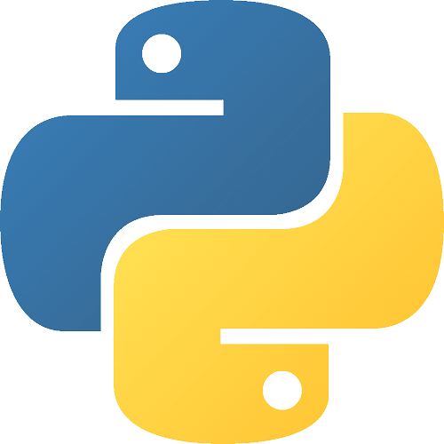
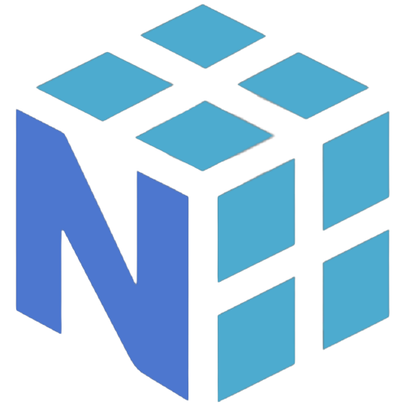
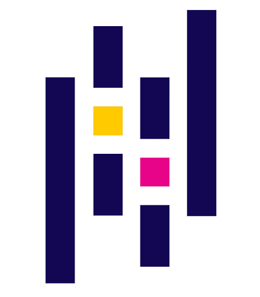
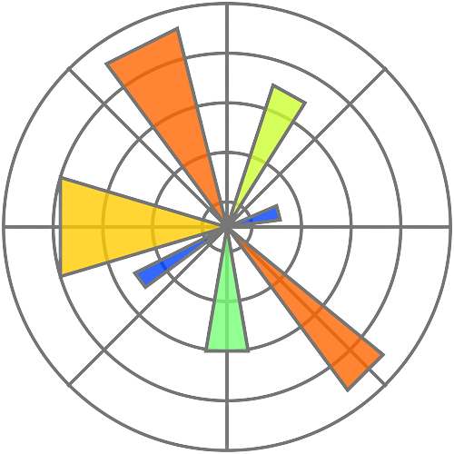
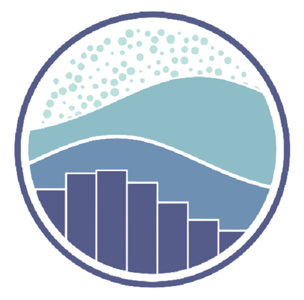
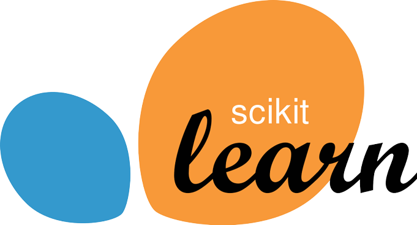
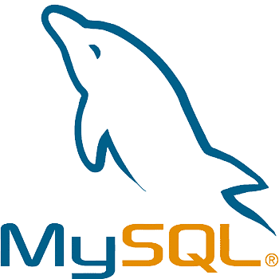

# Hi there, I'm Hamza Aziz👋🏼

## I'm a Data Science Enthusiast 📊

- 🔭 Currently, I am pursuing my Bachelor of Technology in Computer Science and Engineering from [ABES Intitute Of Technology, Ghaziabad](https://www.abesit.in/)
- 🌱 I’m currently exploring the field of Data Science
- 🥅 2023 Goal: Get a job in the field of Data Science and learn more about AI/ML
- ⚡ Fun fact: I love to portrait sketches and to read books

### Connect with me

 
 

### Languages and Tools

 
 

---

### 📙 Books I've Read

- Think Like a Monk: Train Your Mind for Peace and Purpose Every Day *by Jay Shetty*
- Quiet: The Power of Introverts in a World That Can't Stop Talking *by Susan Cain*
- The Introvert Entrepreneur *by Beth Buelow*

---

### 📑 Latest Blog Posts

- [Data Analysis vs Data Analytics](https://hamzaziizzz.hashnode.dev/data-analysis-vs-data-analytics)
