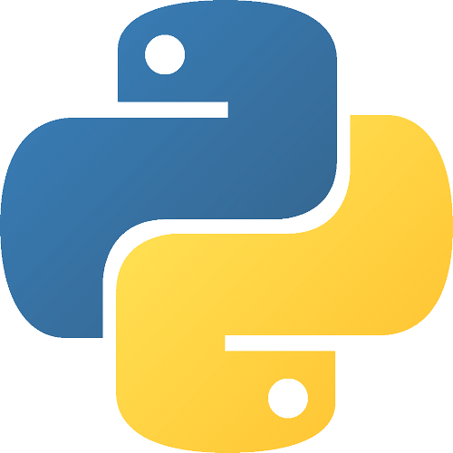
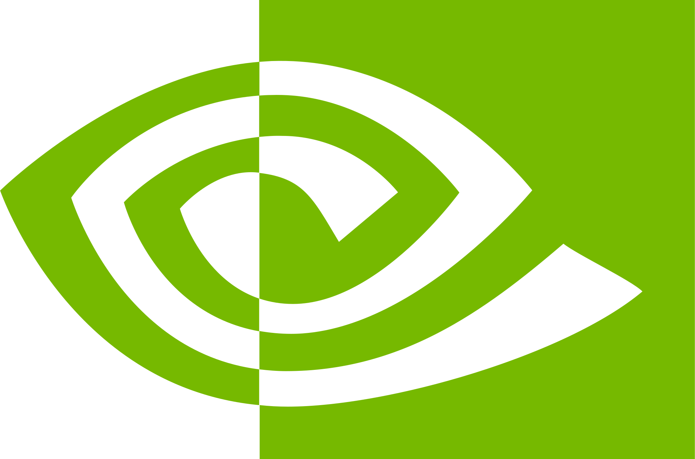
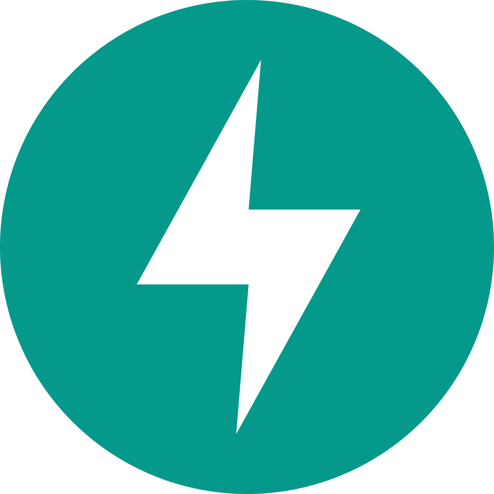
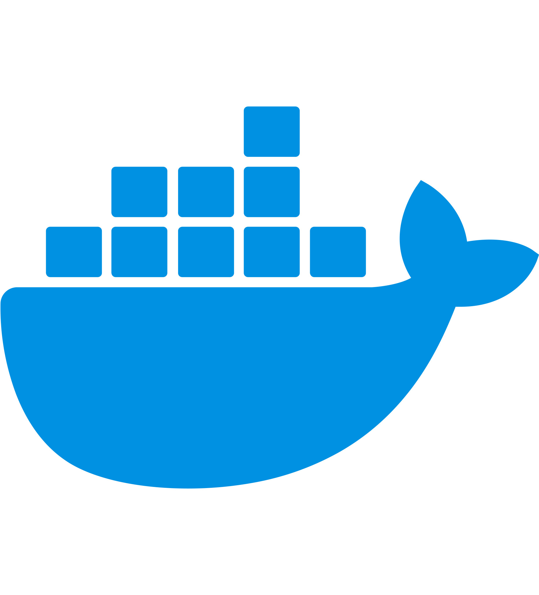

  

# Hi there, I'm Hamza Aziz 

  

## I'm an Artificial Intelligence Engineer 📊

- 💼 Currently working as Assistant AI Engineer at [Global InfoVentures Pvt. Ltd.](https://giindia.com/)
- 🚀 Developing and integrating AI-driven solutions like Conversational AI for SIM Portal and Multi-Person Face Recognition systems into the G5 Portal.
- 🎓 Bachelor of Technology in Computer Science and Engineering from [ABES Institute Of Technology, Ghaziabad](https://www.abesit.in/)
- 🎯 2024 Goal: Enhance my expertise in Conversational AI and Machine Learning.

### Connect with me

 
 

## Skills

### Programming and AI/ML

 

### Web Development

 

### Deployemnt and Containerization

 

### Databse and Backend Technologies

 
 

### Other Softwares

 
 

---

### 📑 Latest Blog Posts

- [OpenCV, PyTorch and TensorFlow for Jetson Nano](https://medium.com/ai-mind-labs/opencv-pytorch-and-tensorflow-for-jetson-nano-c49ab7050fb5)
- [Implementing InceptionNet: A Journey into Multi-Scale Convolutional Networks](https://medium.com/ai-mind-labs/implementing-inceptionnet-a-journey-into-multi-scale-convolutional-networks-53130a531ff)
- [Mastering VGG from Scratch: A Journey of Learning and Growth in Computer Vision](https://medium.com/ai-mind-labs/mastering-vgg-from-scratch-a-journey-of-learning-and-growth-in-computer-vision-ada74a72327f)
- [ResNet-50 Implementation](https://medium.com/ai-mind-labs/resnet-50-implementation-8bde36f2301a)
- [Data Analysis vs Data Analytics](https://hamzaziizzz.hashnode.dev/data-analysis-vs-data-analytics)

---

## 📈 GitHub Stats

---

## Holopin Board

